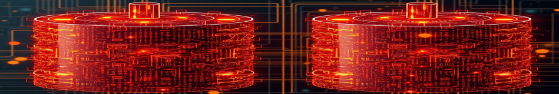

Commandline/terminal **merge utility** for `.jwlibrary` backups created by the *JW Library* app[^1]

By using this software you agree to abide by the terms of its [License](https://github.com/erykjj/jwlFusion#License-1-ov-file).

## Downloads

- [Linux](https://github.com/erykjj/jwlfusion/releases/latest/download/jwlFusion-linux.tgz)
- [macOS 13/14](https://github.com/erykjj/jwlfusion/releases/latest/download/jwlFusion-macos.tar.gz)
- [Windows 10/11](https://github.com/erykjj/jwlfusion/releases/latest/download/jwlFusion-windows.zip)

## Build/compile yourself

### Linux and macOS
```
git clone https://github.com/erykjj/jwlFusion.git
cd jwlFusion
nim c -d:release --out:jwlFusion src/jwlFusion.nim
```
You will have a `jwlFusion` along with the required shared libraries in `lib/`.

### Windows

```
git clone https://github.com/erykjj/jwlFusion.git
cd jwlFusion
nim c -d:release --out:jwlFusion.exe src/jwlFusion.nim
copy lib\*.dll .\
```
You will have a `jwlFusion.exe` along with the required shared `jwlCore.dll` and `sqlite3_64.dll`.

## Usage

```
Usage: jwlFusion [-h | -v]  [-o:output] <original archive> <merge archive> [<merge archive>...]

Options:
  -h, --help                        Show this help message and exit.
  -v, --version                     Show the version and exit.
  -o:<archive>, --output=<archive>  Specify the output archive (optional);
                                      if not provided, creates archive
                                      in working directory.
```

____
#### Footnotes:
[^1]: [JW Library](https://www.jw.org/en/online-help/jw-library/) is a registered trademark of *Watch Tower Bible and Tract Society of Pennsylvania*
